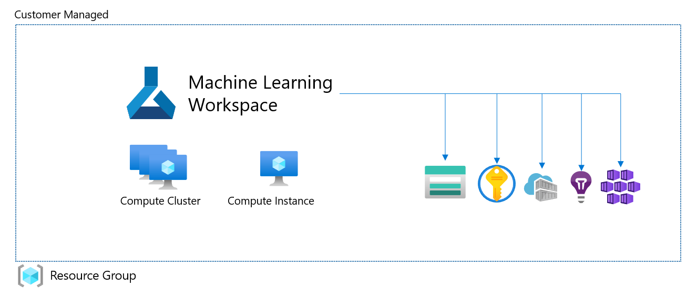

# Azure Machine Learning - Simple Deployment

This Terraform template deploys the following architecture:



It includes:

* Azure Machine Learning Workspace
* Azure Storage Account
* Azure Key Vault
* Azure Container Registry
* Azure Application Insights
* Compute Cluster
* Compute Instance
* (Azure Kubernetes Service - disabled by default and still under development)

## Instructions

Make sure you have the [Azure CLI](https://docs.microsoft.com/en-us/cli/azure/install-azure-cli) and the Azure Machine Learning CLI extension installed (`az extension add -n azure-cli-ml`).

1. Navigate to the scenario folder you want to deploy
1. Copy `terraform.tfvars.example` to `terraform.tfvars`
1. Update `terraform.tfvars` with your desired values
1. Run Terraform
    ```console
    $ cd 100-simple-deployment/
    $ terraform init
    $ terraform plan
    $ terraform apply
    ```

